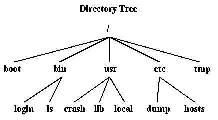
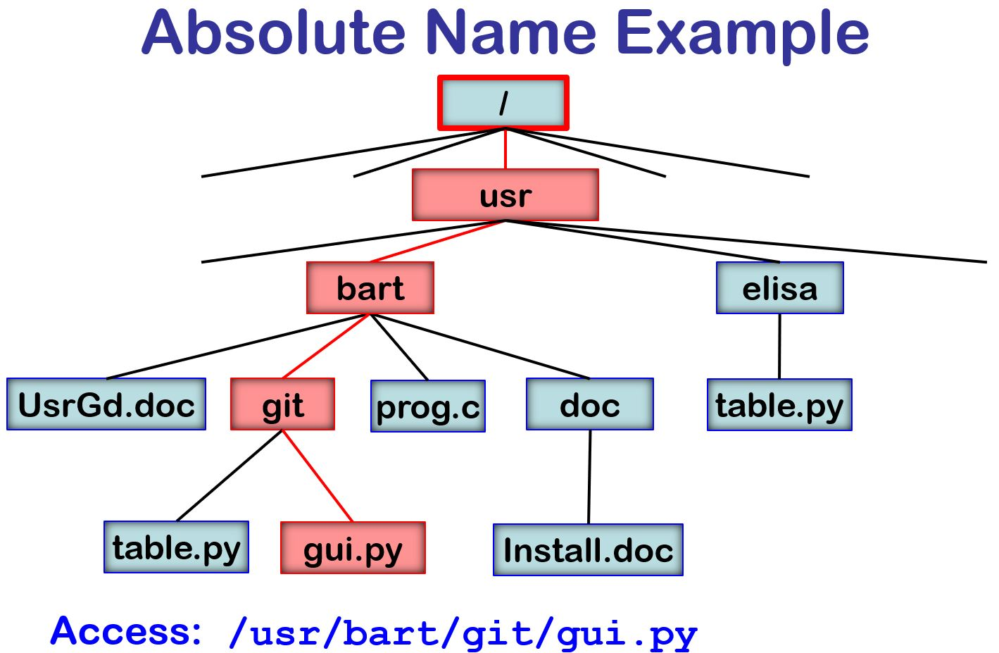
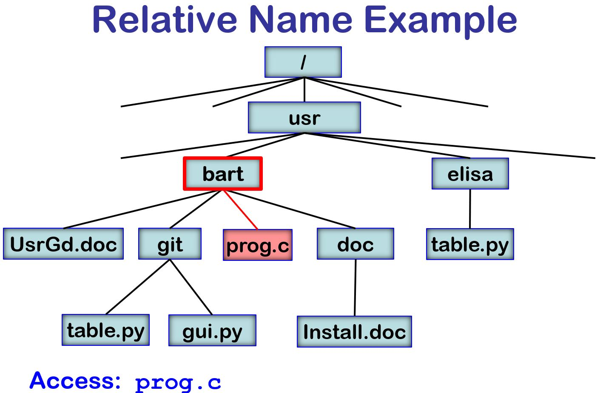

# Week04-class02 · 리눅스 파일 속성

120분 수업(휴식 10분 포함), 슬라이드 38장. 파일 속성 조회와 권한·소유권·크기·시각, 열린 파일의 속성을 실험합니다.

## 1. 리눅스 파일 속성

교수자 메모: 파일과 디렉토리 개요를 복습한 뒤 속성 조회와 변경 결과를 깊이 살펴본다. 학생은 각 값의 의미를 설명하고, 파일 내용 변경과 속성 변경을 구분한다.

## 2. 수업 구성

복습과 1부  파일 속성 조회 · 40분

2부  권한과 소유권 · 30분

3부  파일 크기와 시간 속성 · 25분

4부  이름과 열린 파일의 속성 · 10분

확인 퀴즈와 제출 · 5분

120분 수업, 1부 후 휴식 10분

교수자 메모: 40분 뒤 휴식 10분을 포함해 총 120분이다. 전반부는 stat 계열의 대상과 반환값, 후반부는 권한·크기·시각·링크 수의 변화를 비교한다.

## 3. 파일 내용과 파일 속성

파일 내용: read와 write로 읽고 쓰는 바이트

파일 속성: 종류, 권한, 소유자, 크기, 시간 등의 정보

파일 이름: 디렉토리가 관리하는 이름과 대상의 연결

내용이 같아도 inode와 소유자, 수정 시각은 다를 수 있다.

이번 시간에는 작업 전후의 속성 변화를 비교한다.

교수자 메모: 빈 파일도 종류·권한·소유자 등의 속성을 가진다. 파일 이름은 struct stat의 필드가 아니다. inode 번호는 같은 파일시스템 안에서 해석하며 파일 비교 시 st_dev와 st_ino를 함께 본다.

참고: [inode.7](https://man7.org/linux/man-pages/man7/inode.7.html), [stat.2](https://man7.org/linux/man-pages/man2/stat.2.html)

## 4. 디렉토리 트리



루트 /에서 시작한다.

디렉토리 안에 파일과
다른 디렉토리가 있다.

각 이름을 차례로 찾아
하나의 경로를 해석한다.

그림: Barton P. Miller, UW–Madison CS 537 · Section 25: Directories

교수자 메모: 그림의 루트 /와 usr, local을 가리키며 /usr/local을 읽는다. 디렉토리도 inode를 가진다. 디렉토리의 데이터에는 이름과 inode 번호의 연결이 들어간다. 그림은 원문의 역사적인 디렉토리 예시이며 모든 Linux 설치의 실제 디렉토리 구조를 뜻하지 않는다.

참고: [s25](https://pages.cs.wisc.edu/~bart/537/lecturenotes/s25.html), [s27.unixdir.gif](https://pages.cs.wisc.edu/~bart/537/lecturenotes/figures/s27.unixdir.gif), [directory](https://docs.kernel.org/filesystems/ext4/directory.html)

## 5. 절대 경로의 탐색



/usr/bart/git/gui.py

/에서 usr, bart, git을
차례로 검색한다.

마지막 이름 gui.py에
연결된 파일을 찾는다.

그림: Barton P. Miller, UW–Madison CS 537 · Section 25: Directories

교수자 메모: 그림의 빨간 경로를 따라 /usr/bart/git/gui.py를 읽는다. 각 디렉토리의 이름 엔트리에서 다음 inode를 찾는 과정으로 연결해 설명한다. 절대 경로의 시작점은 프로세스가 보는 루트이며 이 수업의 그림은 마운트·심볼릭 링크 등의 세부 동작을 생략했다.

참고: [s25](https://pages.cs.wisc.edu/~bart/537/lecturenotes/s25.html), [AbsolutePathNameExample.JPG](https://pages.cs.wisc.edu/~bart/537/lecturenotes/figures/AbsolutePathNameExample.JPG), [path_resolution.7](https://man7.org/linux/man-pages/man7/path_resolution.7.html)

## 6. 상대 경로와 현재 디렉토리



현재 디렉토리: /usr/bart

open("prog.c", O_RDONLY)

위 호출은 그림에서
/usr/bart/prog.c를 찾는다.

그림: Barton P. Miller, UW–Madison CS 537 · Section 25: Directories

교수자 메모: 그림의 빨간 테두리 bart는 현재 작업 디렉토리다. 여기에서 prog.c라는 이름을 검색한다. cwd를 바꾸면 같은 상대 경로 문자열도 다른 파일을 가리킬 수 있다. 일반 open의 상대 경로를 설명하며 openat 계열은 지정한 디렉토리 FD를 기준으로 할 수 있다.

참고: [s25](https://pages.cs.wisc.edu/~bart/537/lecturenotes/s25.html), [RelativePathNameExample.JPG](https://pages.cs.wisc.edu/~bart/537/lecturenotes/figures/RelativePathNameExample.JPG), [path_resolution.7](https://man7.org/linux/man-pages/man7/path_resolution.7.html)

## 7. 디렉토리·inode·데이터 블록


원본의 엔트리 c는 경로의 c.c와 표기가 다릅니다. 번호는 캐시를 생략한 설명용 읽기 순서입니다.

그림: Barton P. Miller, UW–Madison CS 537 · Section 25: Directories

교수자 메모: open("/a/b/c.c", O_RDONLY)와 이어지는 read를 그림으로 추적한다. 1 루트 inode, 2 루트 디렉토리 데이터에서 a 검색, 3 a의 inode, 4 a의 데이터에서 b 검색, 5 b의 inode, 6 b의 데이터에서 c.c 검색, 7 일반 파일 inode, 8 실제 파일 데이터 읽기 순서다. 원본의 /a/b 디렉토리 표에는 c라고 적혀 있으나 본문과 오른쪽 라벨은 c.c이다. 이 표기 불일치를 밝히고 c.c 엔트리로 읽어 설명한다. 각 디렉토리가 한 블록에 들어가고 필요한 정보가 캐시되지 않았다는 단순화 모델이므로 실제 Linux에서 항상 8번 물리 디스크 I/O를 한다는 뜻은 아니다. 디렉토리 데이터는 이름과 inode 연결을, 일반 파일 데이터는 내용 바이트를 담는다는 차이를 강조한다. 그림은 원본 그대로 삽입했다.

참고: [s25](https://pages.cs.wisc.edu/~bart/537/lecturenotes/s25.html), [dir+inode.jpg](https://pages.cs.wisc.edu/~bart/537/lecturenotes/figures/dir%2Binode.jpg), [directory](https://docs.kernel.org/filesystems/ext4/directory.html), [path_resolution.7](https://man7.org/linux/man-pages/man7/path_resolution.7.html)

## 8. 1부 파일 속성 조회

어떤 객체를 조회하는지와 반환값을 먼저 확인합니다.

## 9. ls -l의 각 열과 파일 속성

권한과 종류: 첫 문자와 다음 9개 문자를 나누어 읽는다.

소유권: UID와 GID를 이름으로 변환해 표시할 수 있다.

이름: note.txt는 디렉토리 엔트리의 이름이다.

```c
$ ls -l note.txt
-rw-r----- 2 student lab 4 Sep 22 09:00 note.txt

# -           파일 종류
# rw-r-----   기본 접근 권한
# 2           하드 링크 수
# student lab 소유자와 그룹
# 4           일반 파일의 바이트 크기
# Sep 22 ...  기본 표시: 수정 시각
```

교수자 메모: 화면은 설명용 예시다. 계정 이름과 시각은 환경에 따라 달라진다. ls -n은 숫자 ID를 표시하고, ls -ld는 디렉토리 자체의 속성을 보여준다. 크기는 일반 파일을 기준으로 설명한다.

참고: [inode.7](https://man7.org/linux/man-pages/man7/inode.7.html), [stat.2](https://man7.org/linux/man-pages/man2/stat.2.html)

## 10. stat, lstat, fstat의 조회 대상

stat(path, &st): 경로가 가리키는 파일을 조회한다. 마지막 심볼릭 링크도 따라간다.

lstat(path, &st): 마지막 경로 요소가 심볼릭 링크이면 링크 자체를 조회한다.

fstat(fd, &st): 이미 열린 파일 디스크립터가 참조하는 파일을 조회한다.

헤더: <sys/stat.h>. 결과는 struct stat에 저장합니다.

교수자 메모: 세 함수는 성공 0, 실패 -1을 반환한다. 실패하면 errno를 확인한다. lstat도 경로 중간의 심볼릭 링크는 해석한다. 파일 내용의 읽기 권한과 경로 디렉토리 검색 권한을 구분한다.

참고: [stat.2](https://man7.org/linux/man-pages/man2/stat.2.html)

## 11. struct stat의 주요 필드

st_dev / st_ino: 파일시스템 장치 식별과 inode 번호

st_mode / st_nlink: 종류·권한 비트와 하드 링크 수

st_uid / st_gid: 소유 사용자와 그룹의 숫자 ID

st_size / st_blocks / st_blksize: 크기와 할당·입출력 정보

st_atim / st_mtim / st_ctim: 접근·내용 수정·상태 변경 시각

교수자 메모: Linux의 POSIX 필드명을 사용한다. st_atime 등의 이름은 초 부분에 접근하는 호환 이름으로 볼 수 있다. st_dev는 장치 파일 자체가 나타내는 st_rdev와 다르다. 모든 필드가 하나의 원자적 시점 스냅샷이라는 보장은 없다.

참고: [stat.3type](https://man7.org/linux/man-pages/man3/stat.3type.html), [inode.7](https://man7.org/linux/man-pages/man7/inode.7.html)

## 12. file_attr: 조회 후 필드 출력

기본 동작: file_attr는 기본적으로 lstat을 호출한다.

--follow 옵션: 옵션을 주면 stat으로 대상 파일을 따라간다.

출력 자료형: 정수형을 명시적으로 변환해 %ju와 %jd로 출력한다.

```c
struct stat st;
int rc = follow ? stat(path, &st)
                : lstat(path, &st);
if (rc == -1) {
    perror(path);
    return 1;
}
printf("inode=%ju links=%ju\n",
       (uintmax_t)st.st_ino,
       (uintmax_t)st.st_nlink);
printf("size=%jd\n", (intmax_t)st.st_size);
```

완성 예제: labs/class04-02/file_attr.c

교수자 메모: 완성 소스는 인자 검사, 종류·권한 해석, 나노초 시각 출력도 포함한다. 실패한 경우에는 st를 읽지 않는다. --follow는 이 예제에서 정의한 옵션이다.

참고: [stat.2](https://man7.org/linux/man-pages/man2/stat.2.html), [stat.3type](https://man7.org/linux/man-pages/man3/stat.3type.html)

## 13. 파일 종류와 권한 비트 분리

파일 종류: S_ISREG, S_ISDIR 등의 판정 매크로를 사용한다.

기본 rwx: 0777 마스크로 소유자·그룹· 기타 권한을 추출한다.

특수 비트 포함: 07777은 set-ID와 sticky 비트까지 포함한다.

```c
if (S_ISREG(st.st_mode)) puts("regular");
else if (S_ISDIR(st.st_mode)) puts("directory");
else if (S_ISLNK(st.st_mode)) puts("symlink");
else if (S_ISFIFO(st.st_mode)) puts("fifo");

printf("permissions=%04jo\n",
       (uintmax_t)(st.st_mode & 07777));
```

교수자 메모: st_mode 전체를 0644와 직접 비교하면 종류 비트 때문에 잘못된 판정이 된다. S_ISREG 같은 매크로를 사용한다. 완성 예제는 문자·블록 장치와 소켓도 구별한다.

참고: [inode.7](https://man7.org/linux/man-pages/man7/inode.7.html)

## 14. 링크와 inode의 관계

하드 링크: 같은 파일시스템의 동일한 inode를 가리키는 다른 이름이다.

심볼릭 링크: 대상 경로를 저장하는 별도 객체다. lstat으로 자체 속성을 읽는다.

파일 동일성: st_dev와 st_ino를 함께 비교한다. 내용 일치와는 다른 질문이다.

교수자 메모: 하드 링크를 추가하면 같은 파일의 st_nlink가 증가한다. 심볼릭 링크 생성은 대상의 하드 링크 수를 늘리지 않는다. inode 번호는 파일이 제거된 뒤 재사용될 수 있으므로 영구 식별자로 저장하지 않는다.

참고: [link.2](https://man7.org/linux/man-pages/man2/link.2.html), [inode.7](https://man7.org/linux/man-pages/man7/inode.7.html), [stat.2](https://man7.org/linux/man-pages/man2/stat.2.html)

## 15. 실습 1: 링크의 속성 비교

하드 링크: device와 inode가 같고 links가 2인지 비교한다.

심볼릭 링크: 기본 조회와 --follow의 종류·크기를 비교한다.

깨진 링크: lstat은 가능하지만 stat은 실패할 수 있다.

```sh
RUN=$(mktemp -d)
printf 'ABC\n' > "$RUN/note.txt"
ln "$RUN/note.txt" "$RUN/hard.txt"
ln -s note.txt "$RUN/soft.txt"

./file_attr "$RUN/note.txt"
./file_attr "$RUN/hard.txt"
./file_attr "$RUN/soft.txt"
./file_attr --follow "$RUN/soft.txt"
ln -s missing "$RUN/broken.txt"
./file_attr --follow "$RUN/broken.txt"
```

값을 예측한 뒤 실제 결과를 REPORT.md에 기록합니다.

교수자 메모: soft.txt의 lstat 크기는 경로 문자열 note.txt의 길이인 8바이트다. 대상 내용은 ABC와 개행으로 4바이트다. 마지막 실패 뒤 기본 조회 ./file_attr "$RUN/broken.txt"도 실행한다. RUN은 이후 실습에서도 유지한다.

참고: [stat.2](https://man7.org/linux/man-pages/man2/stat.2.html), [link.2](https://man7.org/linux/man-pages/man2/link.2.html)

## 16. 조회 실패와 조회 이후의 변화

ENOENT / ENOTDIR: 없는 경로 또는 중간 요소가 디렉토리가 아닌 경우다.

EACCES: 경로의 디렉토리에서 검색 권한이 부족할 수 있다.

조회와 사용 사이: stat 성공 뒤에도 이름이나 권한이 바뀔 수 있다. 실제 호출을 검사한다.

교수자 메모: stat 전 access를 호출해도 뒤의 open 성공은 보장하지 않는다. 열린 객체를 다룰 때는 fstat으로 그 FD의 속성을 조회한다. fstat은 파일 내용이나 속성을 고정하거나 잠그지는 않는다.

참고: [stat.2](https://man7.org/linux/man-pages/man2/stat.2.html), [path_resolution.7](https://man7.org/linux/man-pages/man7/path_resolution.7.html), [access.2](https://man7.org/linux/man-pages/man2/access.2.html)

## 17. 2부 권한과 소유권

접근 권한 비트를 읽고 생성·변경 결과를 비교합니다.

## 18. 기본 권한과 8진수 표현

소유자(u), 그룹(g), 기타 사용자(o)에 각각 rwx가 있다.

r = 4, w = 2, x = 1을 더해 8진수 한 자리로 표현한다.

0640 = rw-r-----     0755 = rwxr-xr-x

C 코드의 0640은 8진수, 640은 10진수 상수다.

파일 종류와 기본 권한은 st_mode에서 분리해 해석한다.

교수자 메모: 프로세스가 파일 소유자와 일치하면 소유자 권한 비트를 적용한다. 소유자 권한이 없다고 기타 사용자 권한으로 다시 시도하지 않는다. 보조 그룹, ACL과 capability 등도 실제 접근 판단에 영향을 준다.

참고: [inode.7](https://man7.org/linux/man-pages/man7/inode.7.html), [chmod.2](https://man7.org/linux/man-pages/man2/chmod.2.html)

## 19. 권한 비트로 rwx 문자열 만들기

비트 검사: 각 비트와 AND 연산을 해서 권한 유무를 확인한다.

문자 선택: 켜진 비트는 r, w, x로 꺼진 비트는 -로 표시한다.

문자열 끝: 9개 권한 문자 뒤에 널 문자 공간을 둔다.

```c
const mode_t bits[9] = {
    S_IRUSR, S_IWUSR, S_IXUSR,
    S_IRGRP, S_IWGRP, S_IXGRP,
    S_IROTH, S_IWOTH, S_IXOTH
};
char out[10];
for (int i = 0; i < 9; i++)
    out[i] = (mode & bits[i]) ? "rwx"[i % 3] : '-';
out[9] = '\0';
```

완성 예제는 s/S/t/T 표시도 처리합니다.

교수자 메모: 발췌는 기본 rwx 부분이다. 완성 file_attr는 set-user-ID·set-group-ID·sticky bit를 s/S/t/T로 표시한다. 예: set-user-ID가 있고 실행 비트가 없으면 S, 있으면 s다.

참고: [inode.7](https://man7.org/linux/man-pages/man7/inode.7.html)

## 20. 일반 파일과 디렉토리의 권한

일반 파일의 r / w / x: 내용 읽기, 내용 쓰기, 프로그램 실행을 허용한다.

디렉토리의 r / x: r은 이름 목록 읽기, x는 이름 검색과 경로 통과다.

디렉토리의 w와 x: 내부 이름 생성·삭제에는 일반적으로 두 권한이 함께 필요하다.

교수자 메모: 파일 내용 쓰기와 파일 이름 삭제는 다른 동작이다. sticky bit, ACL, capability, 읽기 전용 파일시스템 등 추가 조건이 있을 수 있다. 실습은 root가 아닌 일반 사용자와 자신이 만든 임시 디렉토리에서 진행한다.

참고: [path_resolution.7](https://man7.org/linux/man-pages/man7/path_resolution.7.html), [unlink.2](https://man7.org/linux/man-pages/man2/unlink.2.html)

## 21. chmod와 fchmod

지정한 mode: 지정값으로 권한을 설정한다. 기존 비트에 자동 추가하지 않는다.

변경 주체: 일반적으로 파일 소유자나 적절한 권한이 있는 프로세스다.

변경 결과: 내용을 바꾸지 않아도 ctime을 갱신할 수 있다.

```c
/* 경로가 가리키는 파일의 권한 변경 */
if (chmod(path, 0640) == -1) {
    perror("chmod");
    return 1;
}

/* 이미 열린 파일의 권한 변경 */
if (fchmod(fd, 0600) == -1) {
    perror("fchmod");
    return 1;
}
```

두 함수 모두 성공 0, 실패 -1입니다.

교수자 메모: chmod는 마지막 심볼릭 링크를 따라간다. Linux의 일반 심볼릭 링크 권한을 링크 자체의 접근 제어로 해석하지 않는다. umask는 chmod가 지정한 권한에 다시 적용되지 않는다.

참고: [chmod.2](https://man7.org/linux/man-pages/man2/chmod.2.html), [inode.7](https://man7.org/linux/man-pages/man7/inode.7.html)

## 22. umask와 생성 권한

생성 시 적용: 요청한 mode에서 mask 비트를 제거한다.

비트 연산: mode & ~umask이며 단순한 뺄셈이 아니다.

적용 범위: 이미 존재하는 파일의 권한은 바꾸지 않는다.

```c
/* 기본 ACL이 없는 디렉토리의 예 */
requested = 0666;
mask      = 0022;
result    = 0644;   /* 0666 & ~0022 */

requested = 0666;
mask      = 0077;
result    = 0600;   /* 0666 & ~0077 */

/* umask는 없는 권한 비트를 추가하지 않는다. */
```

교수자 메모: 위 블록은 계산 설명이며 완성 C 프로그램이 아니다. Linux에서 부모 디렉토리에 기본 ACL이 있으면 생성 권한 결정에 그 ACL이 사용되므로 단순 공식을 그대로 적용할 수 없다. 이 실습은 기본 ACL 없는 환경을 가정한다.

참고: [umask.2](https://man7.org/linux/man-pages/man2/umask.2.html), [open.2](https://man7.org/linux/man-pages/man2/open.2.html)

## 23. 생성 후 fstat으로 권한 확인

원래 mask 보관: umask는 이전 mask를 반환한다.

생성 실패도 처리: 기존 이름이면 실패하며 파일을 덮어쓰지 않는다.

원상 복구: 성공·실패 모두 프로세스의 mask를 복원한다.

```c
mode_t old = umask(0077);
int fd = open(path, O_WRONLY | O_CREAT | O_EXCL,
              0666);
int saved = errno;
umask(old);
if (fd == -1) {
    errno = saved;
    perror("open"); return 1;
}
struct stat st;
if (fstat(fd, &st) == -1) {
    perror("fstat"); close(fd); return 1;
}
close(fd);
```

완성 예제: mode_demo.c

교수자 메모: 발췌다. 완성 mode_demo는 close 실패도 검사한다. umask는 프로세스 범위이므로 다중 스레드에서는 임시 변경에도 주의가 필요하다. 자식 프로그램의 umask 변경은 부모 셸의 mask를 바꾸지 않는다.

참고: [umask.2](https://man7.org/linux/man-pages/man2/umask.2.html), [open.2](https://man7.org/linux/man-pages/man2/open.2.html), [stat.2](https://man7.org/linux/man-pages/man2/stat.2.html)

## 24. 소유 사용자와 그룹 변경

st_uid와 st_gid: 파일의 소유 사용자·그룹을 숫자 ID로 저장한다.

chown(path, uid, gid): 지정한 소유권을 변경한다. -1인 인자는 기존 값을 유지한다.

일반 사용자의 제한: 소유 사용자 변경에는 보통 특권이 필요하다. 그룹 변경도 제한된다.

소유권 변경은 성공 0, 실패 -1입니다.

교수자 메모: Linux에서 파일 소유자는 자신이 속한 그룹으로 파일 그룹을 바꿀 수 있다. chown은 심볼릭 링크 대상을, lchown은 링크 자체를 변경한다. 소유권 변경이 set-ID 비트를 지울 수 있다. 수업에서는 소유권을 조회하고, 임의 계정으로의 변경을 요구하지 않는다.

참고: [chown.2](https://man7.org/linux/man-pages/man2/chown.2.html)

## 25. 실습 2: 생성 권한과 chmod

예상 권한: 0666과 mask 022는 0644, mask 077은 0600이다.

생성 후 변경: mode_demo는 첫 파일을 fchmod로 0640으로 바꾼다.

하드 링크: 어느 이름으로 조회해도 같은 권한 변경을 관찰한다.

```c
mkdir "$RUN/modes"
./mode_demo "$RUN/modes"
./file_attr "$RUN/modes/mask022.txt"
./file_attr "$RUN/modes/mask077.txt"
./file_attr "$RUN/modes/groupdir"

chmod 600 "$RUN/note.txt"
./file_attr "$RUN/note.txt"
./file_attr "$RUN/hard.txt"
```

교수자 메모: mode_demo 출력에는 첫 파일의 생성 직후 0644와 fchmod 후 0640이 각각 나온다. 마지막 file_attr 조회는 0640이어야 한다. groupdir는 0777 요청과 mask 0027로 0750이 예상된다. 두 번째 실행은 기존 이름 때문에 실패하는 것이 정상이다.

참고: [umask.2](https://man7.org/linux/man-pages/man2/umask.2.html), [chmod.2](https://man7.org/linux/man-pages/man2/chmod.2.html), [link.2](https://man7.org/linux/man-pages/man2/link.2.html)

## 26. 3부 파일 크기와 시간 속성

논리적 크기, 할당 공간, 세 종류의 시각을 구분합니다.

## 27. st_size, st_blocks, st_blksize

st_size: 일반 파일의 논리적 크기다. 단위는 바이트다.

st_blocks: Linux에서는 파일에 할당된 공간을 512바이트 단위로 나타낸다.

st_blksize: 효율적인 파일 입출력을 위한 권장 블록 크기다.

교수자 메모: st_blksize를 st_blocks의 단위로 곱하지 않는다. st_blocks × 512와 st_size는 서로 다른 질문에 답한다. 디렉토리 크기는 내부 파일 크기의 합이나 파일 개수가 아니다. 압축, 희소 파일, 파일시스템 정책 등에 따라 할당량이 달라진다.

참고: [stat.3type](https://man7.org/linux/man-pages/man3/stat.3type.html), [inode.7](https://man7.org/linux/man-pages/man7/inode.7.html)

## 28. 실습 3: 희소 파일의 크기

논리적 크기: 1,048,576 위치에 한 바이트를 써서 1,048,577바이트가 된다.

비어 있는 구간: 기록하지 않은 앞부분을 읽으면 0바이트 값이 나온다.

할당 공간: 논리적 크기와 할당량을 실제 파일시스템에서 비교한다.

```sh
./sparse_demo "$RUN/sparse.bin"
./file_attr "$RUN/sparse.bin"

# Ubuntu GNU coreutils 명령
stat -c 'size=%s blocks=%b unit=%B' \
  "$RUN/sparse.bin"
du -B1 "$RUN/sparse.bin"

# 코드 핵심: 1 MiB 위치에서 한 바이트 쓰기
# lseek(fd, 1024 * 1024, SEEK_SET);
# write(fd, "X", 1);
```

실습 파일은 O_EXCL로 새로 만들며 기존 파일을 덮어쓰지 않습니다.

교수자 메모: 완성 sparse_demo는 open, lseek, write, fstat, close 반환값을 검사한다. lseek만으로는 파일 크기가 늘지 않으며 뒤에서 실제 쓰기를 해야 한다. 할당량이 특정 숫자나 반드시 작은 값이어야 한다고 채점하지 않는다.

참고: [lseek.2](https://man7.org/linux/man-pages/man2/lseek.2.html), [stat.3type](https://man7.org/linux/man-pages/man3/stat.3type.html)

## 29. atime, mtime, ctime

atime: 접근 시각: 파일 데이터 접근과 관련된다. 마운트 정책에 따라 갱신을 줄일 수 있다.

mtime: 내용 수정 시각: 파일 데이터 쓰기 등 내용 변경과 관련된다.

ctime: 상태 변경 시각: 권한·소유권·링크 수 등 inode 상태 변경과 관련된다.

교수자 메모: ctime은 생성 시각이 아니다. 내용 쓰기는 일반적으로 mtime과 ctime에 영향을 준다. atime은 noatime·relatime 등의 조건 때문에 읽을 때마다 증가한다고 가정하지 않는다. 파일시스템마다 시각 저장 해상도도 다르다.

참고: [inode.7](https://man7.org/linux/man-pages/man7/inode.7.html), [utimensat.2](https://man7.org/linux/man-pages/man2/utimensat.2.html)

## 30. 작업과 시간 속성의 변화

파일 읽기: atime 갱신 여부는 마운트 정책 등의 영향을 받는다.

파일 내용 쓰기: 일반적으로 mtime과 ctime을 갱신한다.

chmod: 내용은 그대로여도 ctime을 갱신한다.

utimensat / futimens: atime과 mtime을 지정할 수 있다.

ctime은 이 API로 임의의 과거 시각을 직접 지정하지 않는다.

교수자 메모: 짧은 간격의 두 작업은 시각 해상도 때문에 같은 숫자로 보일 수 있다. 표시값이 같다고 작업이 일어나지 않았다고 판단하지 않는다. 이번 실습은 과거의 고정 atime·mtime을 지정한 뒤 권한을 바꾸어 의미를 구분한다.

참고: [inode.7](https://man7.org/linux/man-pages/man7/inode.7.html), [chmod.2](https://man7.org/linux/man-pages/man2/chmod.2.html), [utimensat.2](https://man7.org/linux/man-pages/man2/utimensat.2.html)

## 31. futimens로 atime과 mtime 지정

FD 또는 경로: futimens는 FD, utimensat은 경로 기반이다.

특수 지정: UTIME_NOW는 현재 시각, UTIME_OMIT은 기존 값 유지다.

권한 조건: 임의 시각 지정은 보통 파일 소유자나 특권이 필요하다.

```c
struct timespec ts[2] = {
    {1704067200, 0},  /* atime: UTC 2024-01-01 */
    {1704153600, 0}   /* mtime: UTC 2024-01-02 */
};
if (futimens(fd, ts) == -1) {
    perror("futimens");
    return 1;
}

/* ts[0]: atime, ts[1]: mtime */
/* tv_nsec: UTIME_NOW / UTIME_OMIT도 가능 */
```

헤더: <sys/stat.h>. 완성 예제: time_attrs.c

교수자 메모: 지금 시각으로 두 값을 갱신하는 경우와 임의 값을 지정하는 경우의 권한 조건은 다르다. 실습은 자신이 새로 만든 파일에 수행한다. utimensat에 AT_SYMLINK_NOFOLLOW를 주면 마지막 링크 자체를 대상으로 삼을 수 있다.

참고: [utimensat.2](https://man7.org/linux/man-pages/man2/utimensat.2.html)

## 32. 실습 4: 시간 속성의 의미

고정한 시각: atime은 1704067200, mtime은 1704153600이다.

권한 변경 후: atime과 mtime은 유지되는지 확인한다.

ctime 해석: 현재의 상태 변경을 반영한다. 생성 시각으로 해석하지 않는다.

```sh
./time_attrs "$RUN/times.txt"
./file_attr "$RUN/times.txt"

# Ubuntu에서 이름과 시간을 함께 확인
stat -c 'atime=%X mtime=%Y ctime=%Z' \
  "$RUN/times.txt"

# 프로그램의 두 출력 단계
# after_futimens: atime과 mtime을 과거로 설정
# after_fchmod:   권한만 0640으로 변경
```

교수자 메모: 연속 출력의 ctime이 같은 숫자여도 틀린 결과가 아니다. time_attrs는 content를 읽지 않으며 futimens와 fchmod 후 fstat만 수행한다. 시각의 의미와 변하지 않아야 할 값이 핵심이다.

참고: [utimensat.2](https://man7.org/linux/man-pages/man2/utimensat.2.html), [chmod.2](https://man7.org/linux/man-pages/man2/chmod.2.html), [inode.7](https://man7.org/linux/man-pages/man7/inode.7.html)

## 33. 4부 이름과 열린 파일의 속성

이름을 지운 뒤에도 열린 FD에서 속성을 조회합니다.

## 34. unlink 이후의 fstat

이름 삭제: unlink는 디렉토리에서 이름 하나를 제거한다.

열린 참조: 마지막 하드 링크가 없어도 열린 FD가 파일 참조를 유지할 수 있다.

관찰할 속성: 같은 inode와 크기를 읽고, 하드 링크 수 0을 확인할 수 있다.

교수자 메모: 실습은 파일을 만든 뒤 다른 하드 링크를 추가하지 않는다. unlink 이후에는 경로 조회가 ENOENT로 실패하지만 열린 FD를 통한 fstat과 읽기는 가능하다. 최종 공간 회수에는 열린 참조 등 파일 수명 조건이 모두 해소되어야 한다.

참고: [unlink.2](https://man7.org/linux/man-pages/man2/unlink.2.html), [stat.2](https://man7.org/linux/man-pages/man2/stat.2.html)

## 35. 실습 5: 이름 삭제 후 속성 조회

전용 임시 파일: 예제가 만든 임시 파일만 대상으로 실험한다.

속성 비교: before와 after의 inode·크기와 링크 수를 비교한다.

결과 설명: 이름의 존재와 열린 객체의 수명을 구별한다.

```sh
./fd_unlink_demo

# 프로그램 내부의 실행 순서
# mkstemp: 전용 임시 파일 생성
# write:   "hello" 5바이트 기록
# fstat:   inode, links=1, size=5 출력
# unlink:  방금 만든 이름 제거
# fstat:   같은 inode, links=0, size=5
# read:    열린 FD로 "hello" 읽기
# close:   열린 참조 정리
```

교수자 메모: fd_unlink_demo는 명령 인자를 받지 않고 mkstemp로 자기 임시 파일만 생성·삭제한다. 정상 실행 뒤 파일이 남지 않는지도 자동 검사한다. Linux 로컬 파일시스템을 수업 기준으로 하며 NFS 등 특수 환경은 별도 해석이 필요하다.

참고: [unlink.2](https://man7.org/linux/man-pages/man2/unlink.2.html), [stat.2](https://man7.org/linux/man-pages/man2/stat.2.html), [open.2](https://man7.org/linux/man-pages/man2/open.2.html)

## 36. 확인 퀴즈

깨진 심볼릭 링크에서 stat과 lstat은 어떻게 다른가?

st_mode 전체를 0644와 직접 비교하면 왜 안 되는가?

기본 ACL이 없을 때 0666과 umask 0027의 결과는?

chmod로 ctime이 바뀌면 파일 내용도 바뀐 것인가?

unlink 뒤 fstat에서 links=0이 나와도 읽을 수 있는 이유는?

교수자 메모: 정답: 1. stat은 없는 대상을 따라가 실패하고 lstat은 링크 자체를 조회한다. 2. 종류와 특수 비트도 포함되므로 목적에 맞는 마스크가 필요하다. 3. 0640. 4. 아니다. 상태 변경 시각이다. 5. 열린 FD가 참조를 유지한다.

## 37. 실습 정리와 제출

file_attr의 필드를 종류·권한·소유권·크기·시간으로 설명한다.

링크 종류에 따른 조회 결과와 실패 경로를 기록한다.

umask와 chmod 전후의 권한 변화를 비교한다.

논리적 크기와 할당 공간, mtime과 ctime을 구별한다.

C 소스, REPORT.md, 실행 로그를 제출한다.

선택 확장: mini_ls에 파일 속성 열 추가

교수자 메모: 선택 과제는 이전 mini_ls에 rwx 문자열과 UID/GID, 크기, mtime을 출력하는 기능을 추가하는 것이다. 재귀 탐색이나 시스템 정보 조회로 범위를 넓히지 않고 파일 속성 해석에 집중한다.

## 38. 참고 자료

Linux man-pages: stat(2), stat(3type), inode(7)

Linux man-pages: chmod(2), chown(2), umask(2)

Linux man-pages: utimensat(2), lseek(2)

Linux man-pages: link(2), unlink(2), open(2)

Linux man-pages: path_resolution(7), access(2)

그림 출처: Barton P. Miller, UW–Madison CS 537 · Section 25

교수자 메모: 각 슬라이드 발표자 노트와 교안 원고에 관련 원문 링크가 있다. 수업은 Ubuntu 일반 사용자와 자신이 만든 임시 파일을 기준으로 한다. 반환값, 자료형, 적용 대상, 실패 조건을 함께 확인한다. 디렉토리 관련 원본 그림 4개는 Barton P. Miller의 CS 537 Section 25: Directories에서 가져왔다. 원본 URL과 이용 안내는 assets/cs537/README.md에 기록했다.

참고: [stat.2](https://man7.org/linux/man-pages/man2/stat.2.html), [stat.3type](https://man7.org/linux/man-pages/man3/stat.3type.html), [inode.7](https://man7.org/linux/man-pages/man7/inode.7.html), [chmod.2](https://man7.org/linux/man-pages/man2/chmod.2.html), [chown.2](https://man7.org/linux/man-pages/man2/chown.2.html), [umask.2](https://man7.org/linux/man-pages/man2/umask.2.html), [utimensat.2](https://man7.org/linux/man-pages/man2/utimensat.2.html), [link.2](https://man7.org/linux/man-pages/man2/link.2.html), [unlink.2](https://man7.org/linux/man-pages/man2/unlink.2.html), [open.2](https://man7.org/linux/man-pages/man2/open.2.html), [lseek.2](https://man7.org/linux/man-pages/man2/lseek.2.html), [path_resolution.7](https://man7.org/linux/man-pages/man7/path_resolution.7.html), [access.2](https://man7.org/linux/man-pages/man2/access.2.html), [s25](https://pages.cs.wisc.edu/~bart/537/lecturenotes/s25.html)
